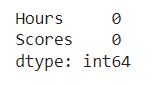
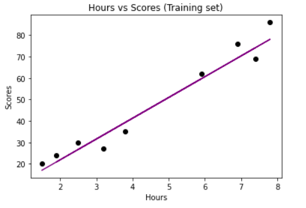

# Implementation-of-Linear-Regression-Using-Gradient-Descent

## AIM:
To write a program to implement the linear regression using gradient descent.

## Equipments Required:
1. Hardware – PCs
2. Anaconda – Python 3.7 Installation / Moodle-Code Runner

## Algorithm
1. Import necessary library
2. create new variable to read a CSV file
3. using training and test values on data-set,predict the linear line.
4. print the program.

## Program:
```
'''
Program to implement the linear regression using gradient descent.
Developed by: Jegathish s
RegisterNumber:  212221230041
'''
import numpy as np
import pandas as pd
import matplotlib.pyplot as plt
from sklearn.linear_model import LinearRegression
from sklearn.model_selection import train_test_split
dataset=pd.read_csv("/content/std_score.csv")
dataset.head()
dataset.tail()
x = dataset.iloc[:,:-1].values    #.iloc[:,start_col,end_col]
y = dataset.iloc[:,1].values
x_train,x_test,y_train,y_test=train_test_split(x,y,test_size=1/3,random_state=0)
regressor=LinearRegression()
regressor.fit(x_train,y_train)
y_pred=regressor.predict(x_test)

# For training data
plt.scatter(x_train,y_train,color='blue')
plt.plot(x_train,regressor.predict(x_train),color='green')
plt.title("Hours vs Scores (Training set)")
plt.xlabel("Hours")
plt.ylabel("Scores")
plt.show()

# For testing data
plt.scatter(x_test,y_test,color='black')
plt.plot(x_test,regressor.predict(x_test),color='purple')
plt.title("Hours vs Scores (Training set)")
plt.xlabel("Hours")
plt.ylabel("Scores")
plt.show()
```

## Output:
## Training Data:

## Testing Data:


## Result:
Thus the program to implement the linear regression using gradient descent is written and verified using python programming.
